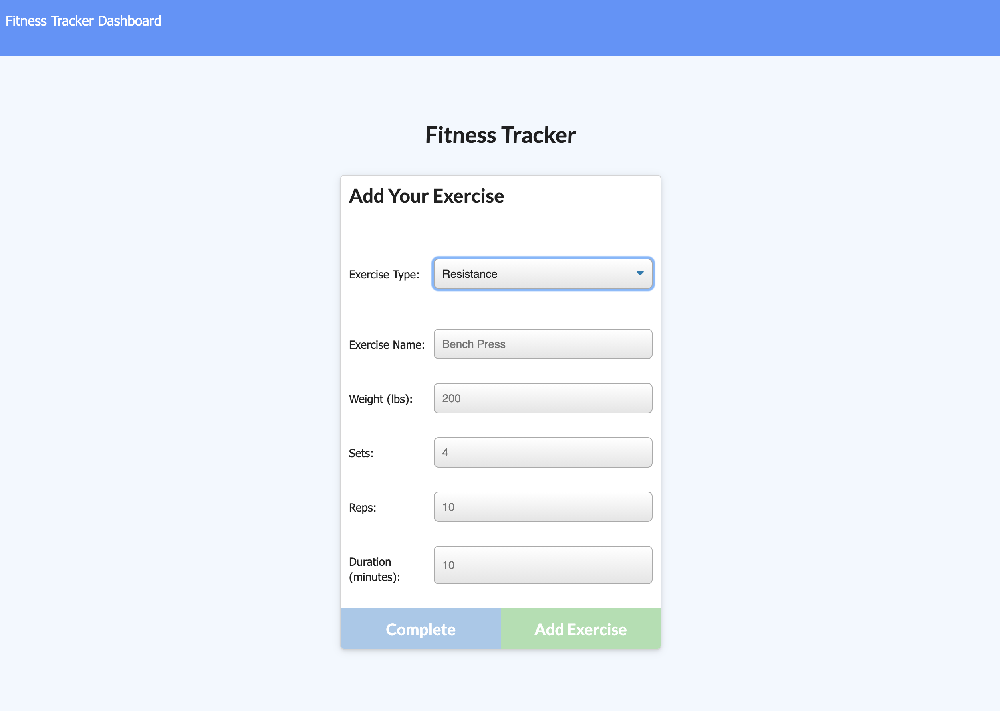

# Workout Tracker


## Description
You can add exercises to your last workout or start a new workout. You can see the stats for that workout and all of your workouts for the week. 

## Links
Deployed link: https://workout-tracker-37.herokuapp.com/

Repo link: https://github.com/jttilley/WorkoutTracker

## Author
Jason Tilley

## Tech Used
HTTP, CSS, JavaScript, Bootstrap, jQuery, ES6, Node.js, express, path, Mongoose database

## Table of Contents
* [Example](#example)
  
  
  * [Installation](#installation)
  
  * [Usage](#usage)
  
  * [License](#license)

  * [Tests](#tests)
  
  * [Questions](#questions)
    

## Example
It shows you the stats from your last workout:


You can add a resistance exercise:


or a cardio exercise:


And then you can see your stats charted out:


## Installation
To install the necessary denpendencies, run the following command:
```
npm i
```

## Usage
* Fork it
* Clone it to your computer
* run "node server" in the terminal
* go to your localhost:3000 in your web browser

## License
The license for this project is: *MIT* ©  2020 Jason Tilley
  

## Contributing
Fork it

## Tests
In the terminal run "npm run seed"

## Questions
If you have any questions you can email me at: jttilley007@gmail.com

Also feel free to check out my GitHub page here: https://github.com/jttilley
  

